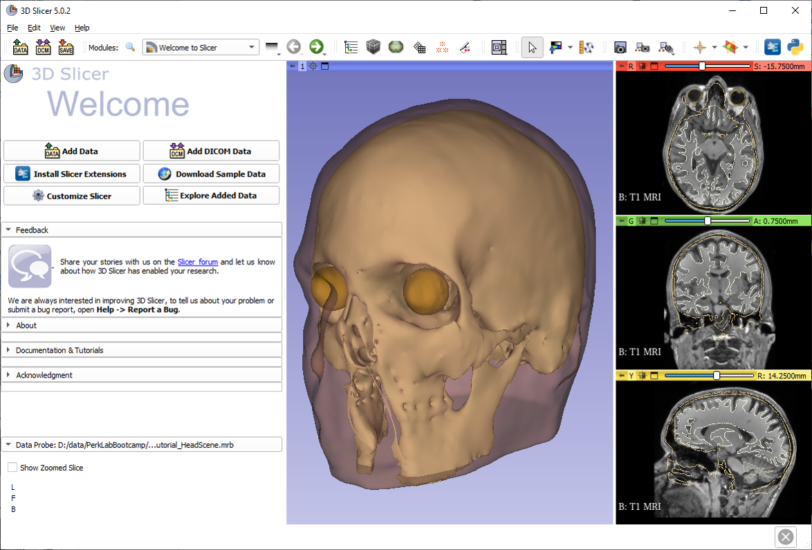

# 3D Slicer
## Data Loading and   Visualization Tutorial

---
<!-- footer:   "Laboratory for Percutaneous Surgery – Copyright © Queen’s University, 2022"  -->

# Tutorial Dataset

### Please download the following datasets:
<https://github.com/PerkLab/PerkLabBootcamp/raw/master/Data/VisualizationTutorial_HeadScene.mrb>

---
# Main user interface

